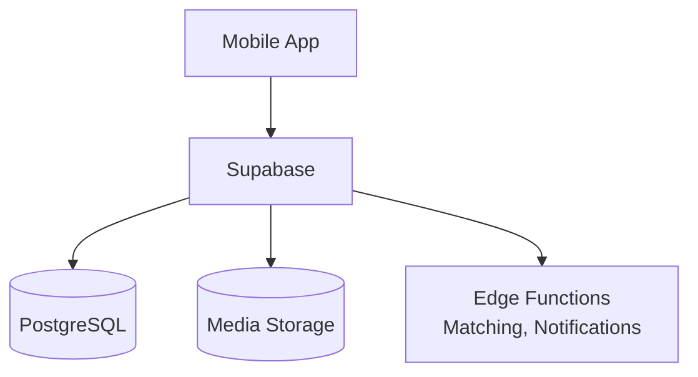
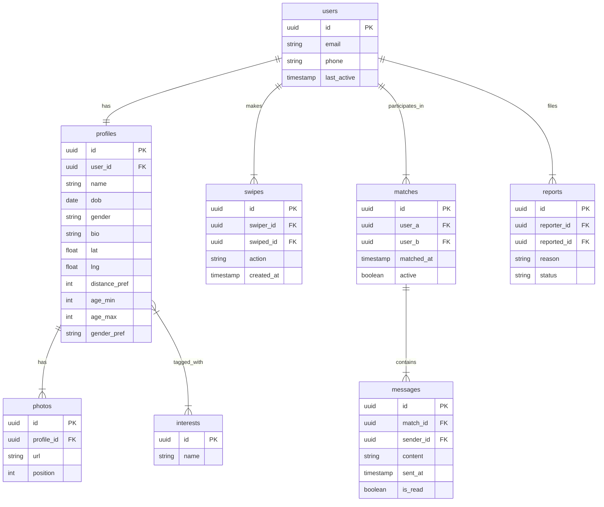
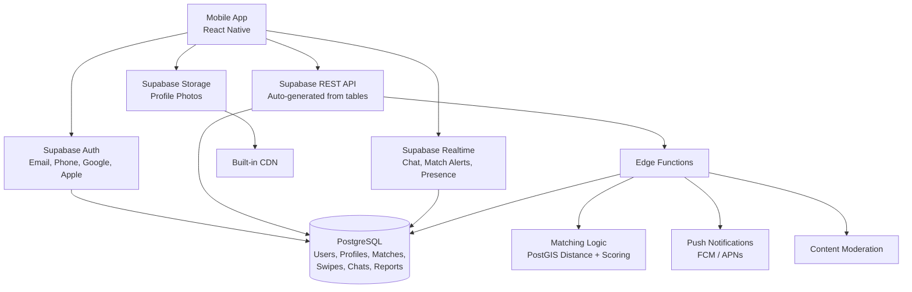

# Dating App - Architecture (Supabase)

## Infrastructure Diagram

---

## How It Works

| Layer | Supabase Feature | Purpose |
|-------|-----------------|---------|
| **Auth** | Supabase Auth | Sign up, log in, social login, phone OTP |
| **API** | Auto REST API | CRUD for profiles, swipes, matches — no backend code |
| **Realtime** | Supabase Realtime | Live chat messages, match notifications, online status |
| **Storage** | Supabase Storage | Profile photo upload with built-in CDN delivery |
| **Database** | Managed PostgreSQL | All app data in one database with row-level security |
| **Edge Functions** | Deno Functions | Matching algorithm, push notifications, moderation |

---

## Database Tables

---

## What You Don't Need to Build

- **Backend server** — Supabase API + Edge Functions
- **Auth service** — Supabase Auth
- **WebSocket server** — Supabase Realtime
- **File storage / CDN** — Supabase Storage
- **Database hosting** — Managed PostgreSQL
- **Row-level security** — Built into Supabase policies

---

## Advantages Over Custom Backend Architecture

The custom backend approach (`architecture.md`) uses a Node.js/Express server that you build and maintain yourself. Here's what the Supabase architecture gains:

| Area | Custom Backend (architecture.md) | Supabase (this doc) |
|------|----------------------------------|---------------------|
| **Auth** | Build from scratch (JWT, OAuth, OTP) | Built-in — email, phone, social login in minutes |
| **API** | Write all Express routes manually | Auto-generated REST API from database tables |
| **Real-time** | Polling or add Firebase separately | Built-in Realtime — chat, presence, match alerts |
| **Storage** | Set up S3 + signed URLs + upload logic | Built-in Storage with CDN, upload policies |
| **Security** | Write middleware for every endpoint | Row-level security policies at the database level |
| **Hosting** | Provision server, manage uptime, scaling | Fully managed — zero server ops |
| **Cost** | Server + DB + S3 + domain + SSL | Free tier covers ~2000 users, then ~$25/mo |
| **Time to launch** | Weeks (build API, auth, file handling) | Days (configure tables, policies, ship) |
| **Maintenance** | You patch, update, monitor the server | Supabase handles infra, backups, updates |

### Key Wins

1. **No backend code to write** — skip building Express routes, auth middleware, file upload handlers
2. **Real-time out of the box** — chat and match notifications work without a separate WebSocket server
3. **Security by default** — row-level policies enforce data access at the database, not in application code
4. **Faster to ship** — go from idea to working app in days, not weeks
5. **Lower ops burden** — no server to monitor, patch, or scale
6. **Free tier fits the scale** — 2000 users fits comfortably within Supabase's free plan

---

## Supabase Resource Limitations

While Supabase is a great fit at this scale, it comes with limits you should be aware of:

### Free Tier Limits

| Resource | Free Tier Limit | Impact on Dating App |
|----------|----------------|----------------------|
| **Database** | 500 MB | Enough for ~2000 users, gets tight with chat history growth |
| **Storage** | 1 GB | ~150-200 users at 6 photos each (avg 1 MB per photo) |
| **Bandwidth** | 5 GB / month | Photo-heavy browsing can hit this quickly |
| **Edge Function invocations** | 500K / month | Matching logic calls per swipe add up |
| **Realtime connections** | 200 concurrent | Fine for 2000 total users, not 2000 online at once |
| **Auth users** | 50,000 MAU | No issue at this scale |
| **API requests** | No hard limit, but rate-limited | Throttled under heavy load |

### Pro Tier ($25/mo) Limits

| Resource | Pro Tier Limit | Notes |
|----------|---------------|-------|
| **Database** | 8 GB | Comfortable for growth beyond 2000 users |
| **Storage** | 100 GB | Plenty for photos |
| **Bandwidth** | 250 GB / month | Handles photo-heavy usage |
| **Edge Function invocations** | 2M / month | Sufficient for matching + notifications |
| **Realtime connections** | 500 concurrent | May need upgrade if app goes viral |

### Limitations vs Custom Backend

| Limitation | Supabase | Custom Backend |
|-----------|----------|----------------|
| **Complex queries** | Limited to what PostgREST exposes; complex joins need database functions or Edge Functions | Full control with any ORM or raw SQL |
| **Background jobs** | No built-in cron; need external scheduler or pg_cron extension | Full control with Bull, Agenda, or cron |
| **Custom WebSocket logic** | Realtime only listens to DB changes; no custom event channels | Full control with Socket.io or ws |
| **Vendor lock-in** | Tied to Supabase APIs; migration requires rewriting auth, storage, realtime | You own the full stack |
| **Cold starts** | Edge Functions have cold start latency (~200-500ms) | Always-on server has no cold starts |
| **File processing** | No built-in image resize/crop; need Edge Function or external service | Full control with Sharp, ffmpeg, etc. |
| **Rate limits** | Shared infra rate limits on free/pro tiers | You set your own limits |
| **Region availability** | Limited regions for database hosting | Deploy anywhere |

### Recommendation for ~2000 Users

- **Start on Free Tier** — sufficient for MVP and early users
- **Upgrade to Pro ($25/mo)** when storage or bandwidth hits limits
- **Watch for** — storage (photos fill up fast) and concurrent Realtime connections
- **Plan ahead** — if you expect rapid growth beyond 10K users, design Edge Functions to be portable so you can migrate to a custom backend later if needed

---

## Detailed Infrastructure Diagram

