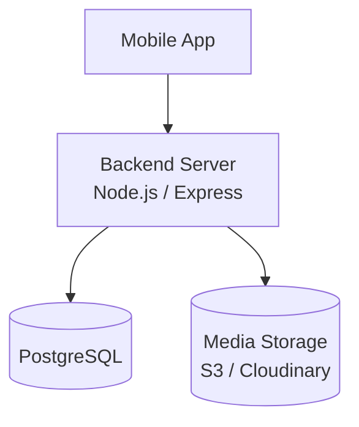

# BKB Community App - Architecture (Small Scale ~2000 Users)

## How It Works

| Layer | Purpose |
|-------|---------|
| **Mobile App** | iOS/Android client (React Native) |
| **Backend Server** | Single server handling API, auth, matching, chat, notifications |
| **PostgreSQL** | All data — users, profiles, matches, chats, payments |
| **Media Storage** | Profile photos (S3 or Cloudinary) |

## Why This Is Enough for 2000 Users

- **No microservices** — a single server handles everything
- **No CDN** — direct media serving works fine at this scale
- **No WebSocket server** — polling or Firebase for real-time chat
- **No message queue** — synchronous processing is fast enough
- **No Redis** — PostgreSQL handles caching needs at this load
- **Single database** — PostgreSQL with proper indexes handles all queries
