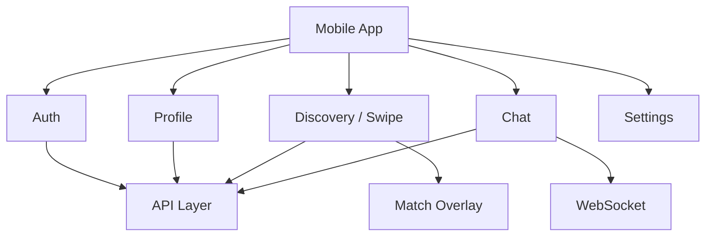
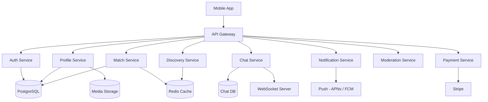
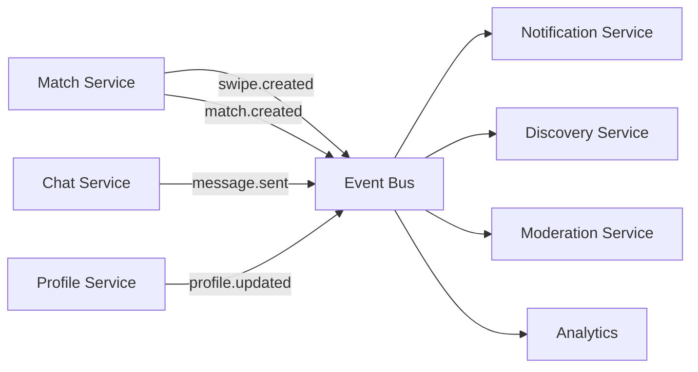
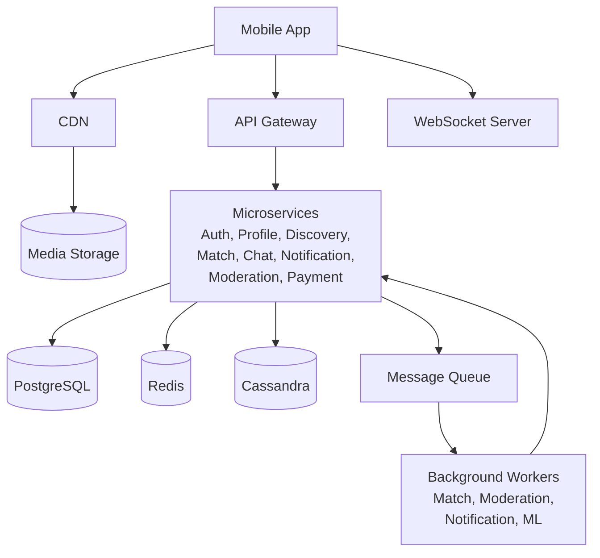

# BKB Community App - Component Architecture

## 1. Frontend Components

```mermaid
graph TB
    App[Mobile App] --> Auth[Auth]
    App --> Profile[Profile]
    App --> Discover[Discovery / Swipe]
    App --> Chat[Chat]
    App --> Settings[Settings]

    Discover --> Matching[Match Overlay]

    Auth --> API[API Layer]
    Profile --> API
    Discover --> API
    Chat --> API
    Chat --> WS[WebSocket]
```

---

## 2. Backend Services

```mermaid
graph TB
    Client[Mobile App] --> GW[API Gateway]

    GW --> Auth[Auth Service]
    GW --> Profile[Profile Service]
    GW --> Discovery[Discovery Service]
    GW --> Match[Match Service]
    GW --> Chat[Chat Service]
    GW --> Notif[Notification Service]
    GW --> Mod[Moderation Service]
    GW --> Pay[Payment Service]

    Auth --> DB[(PostgreSQL)]
    Profile --> DB
    Profile --> S3[(Media Storage)]
    Match --> DB
    Match --> Redis[(Redis Cache)]
    Discovery --> Redis
    Chat --> ChatDB[(Chat DB)]
    Chat --> WS[WebSocket Server]
    Notif --> Push[Push - APNs / FCM]
    Pay --> Stripe[Stripe]
```

---

## 3. Data Flow

```mermaid
flowchart LR
    Match[Match Service] -->|swipe.created| Queue[Event Bus]
    Match -->|match.created| Queue
    Chat[Chat Service] -->|message.sent| Queue
    Profile[Profile Service] -->|profile.updated| Queue

    Queue --> Notif[Notification Service]
    Queue --> Discovery[Discovery Service]
    Queue --> Mod[Moderation Service]
    Queue --> Analytics[Analytics]
```

---

## 4. Infrastructure

```mermaid
graph TB
    App[Mobile App] --> CDN[CDN]
    App --> GW[API Gateway]
    App --> WS[WebSocket Server]

    CDN --> S3[(Media Storage)]

    GW --> Services[Microservices<br/>Auth, Profile, Discovery,<br/>Match, Chat, Notification,<br/>Moderation, Payment]

    Services --> PG[(PostgreSQL)]
    Services --> Redis[(Redis)]
    Services --> ChatDB[(Cassandra)]
    Services --> Queue[Message Queue]

    Queue --> Workers[Background Workers<br/>Match, Moderation,<br/>Notification, ML]

    Workers --> Services
```
