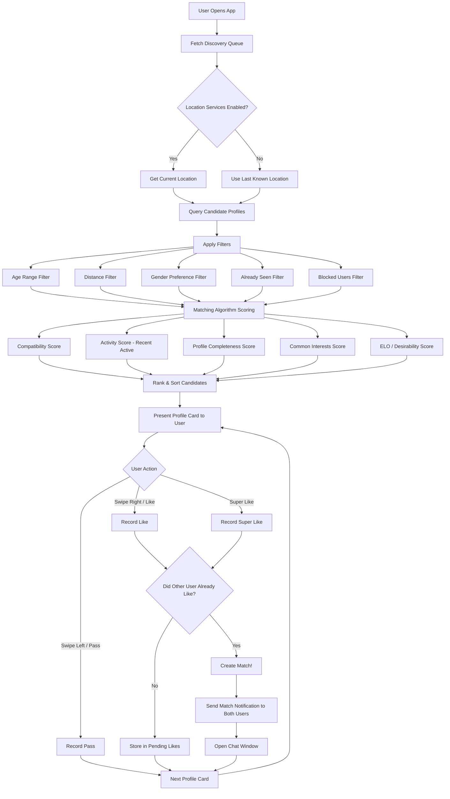
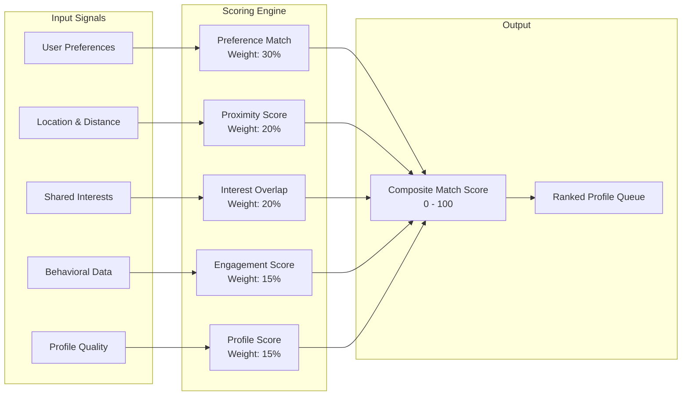
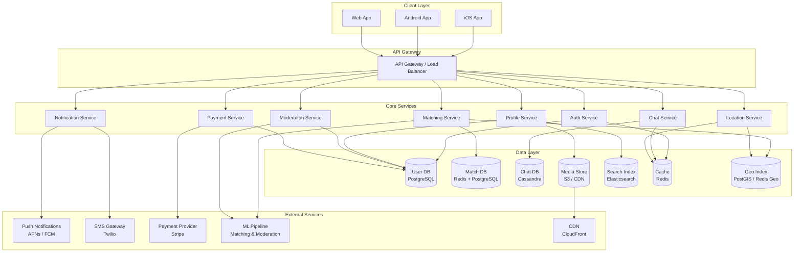
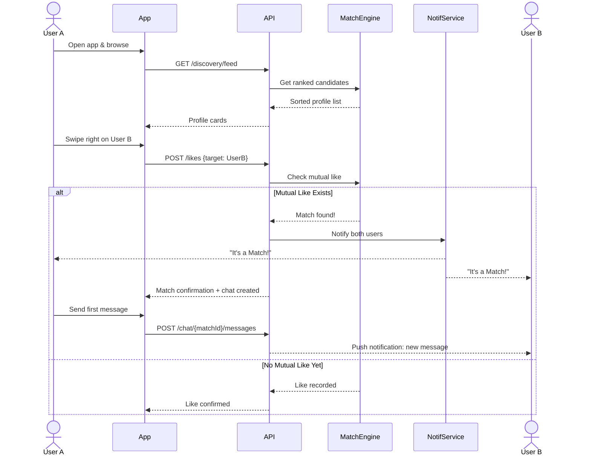
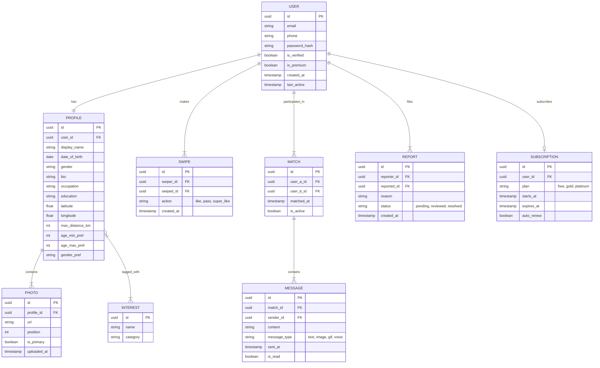
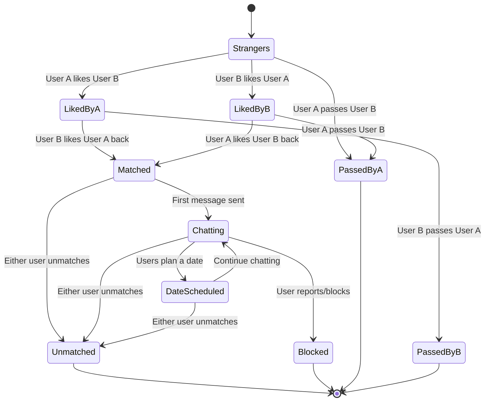

# BKB Community App - Use Cases & Architecture Diagrams

## 1. Use Case Diagram

```mermaid
graph TB
    subgraph "BKB Community App Use Cases"
        subgraph "Authentication"
            UC1[Sign Up]
            UC2[Log In / Log Out]
            UC3[Social Login - Google/Apple]
            UC4[Phone Verification]
        end

        subgraph "Profile Management"
            UC5[Create Profile]
            UC6[Upload Photos]
            UC7[Edit Bio & Details]
            UC8[Set Preferences - Age, Distance, Gender]
            UC9[Verify Profile - Selfie Check]
            UC10[Manage Prompts & Icebreakers]
        end

        subgraph "Discovery & Matching"
            UC11[Browse Profiles - Swipe]
            UC12[Like / Super Like]
            UC13[Dislike / Pass]
            UC14[Rewind Last Action]
            UC15[View Who Liked You]
            UC16[Receive Match Notification]
            UC17[Explore by Filters]
        end

        subgraph "Messaging"
            UC18[Send Text Message]
            UC19[Send GIF / Emoji]
            UC20[Send Voice Note]
            UC21[Send Photo in Chat]
            UC22[Video Call]
            UC23[Icebreaker / First Move]
        end

        subgraph "Safety & Moderation"
            UC24[Report User]
            UC25[Block User]
            UC26[Unmatch]
            UC27[Hide Profile]
            UC28[Share Date Details - Safety Check-in]
        end

        subgraph "Premium Features"
            UC29[Subscribe to Premium]
            UC30[Boost Profile]
            UC31[See Who Liked You]
            UC32[Unlimited Likes]
            UC33[Passport - Change Location]
        end

        subgraph "Settings"
            UC34[Push Notification Preferences]
            UC35[Privacy Settings]
            UC36[Delete Account]
            UC37[Manage Subscription]
        end
    end

    User((User)) --> UC1 & UC2 & UC3
    User --> UC5 & UC6 & UC7 & UC8 & UC9 & UC10
    User --> UC11 & UC12 & UC13 & UC14 & UC15 & UC17
    User --> UC18 & UC19 & UC20 & UC21 & UC22 & UC23
    User --> UC24 & UC25 & UC26 & UC27 & UC28
    User --> UC29 & UC30 & UC31 & UC32 & UC33
    User --> UC34 & UC35 & UC36 & UC37

    Admin((Admin)) --> UC24
    Admin --> ModReview[Review Reports]
    Admin --> ModBan[Ban Users]
    Admin --> ModContent[Content Moderation]

    System((System)) --> UC16
    System --> MatchEngine[Run Matching Algorithm]
    System --> FraudDetect[Fraud Detection]
```

---

## 2. Profile Matching Flow

---

## 3. Matching Algorithm Detail

---

## 4. System Architecture Overview

---

## 5. User Journey - Swipe to Date

---

## 6. Entity Relationship Diagram

---

## 7. State Diagram - User Relationship Lifecycle

