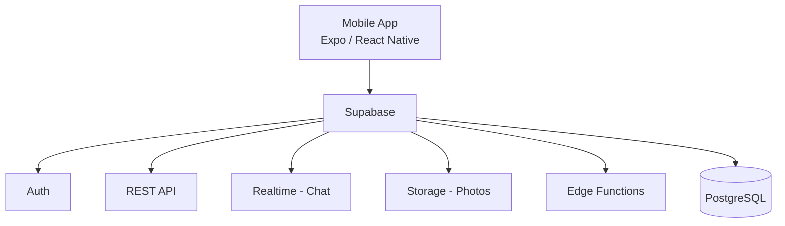

# Dating App - Tech Stack Decision

## Recommended Stack



---

## Why Expo / React Native

| Option | Pros | Cons | Verdict |
|--------|------|------|---------|
| **Vanilla JS** | Simple, no framework | No mobile components, no native APIs, build everything from scratch | Not suitable |
| **React JS (Web App)** | Fast to build, familiar | No app store presence, no push notifications, no native gestures, feels like a website | Not ideal |
| **React Native (Expo)** | One codebase for iOS + Android, native feel, rich ecosystem, Supabase SDK works out of the box | Slightly larger bundle than native | Best fit |

---

## What Expo Gives You

| Feature | How It Helps |
|---------|-------------|
| **No Xcode/Android Studio** | Start building immediately with Expo Go |
| **Push Notifications** | Built-in via `expo-notifications` (FCM + APNs) |
| **Camera & Image Picker** | For profile photo uploads |
| **Location** | For proximity-based matching |
| **Gestures** | Swipe left/right with `react-native-gesture-handler` |
| **Over-the-Air Updates** | Push bug fixes without app store review |
| **EAS Build** | Handles app store builds and submissions |

---

## Key Libraries

| Purpose | Library |
|---------|---------|
| Navigation | `react-navigation` |
| Supabase client | `@supabase/supabase-js` |
| Swipe cards | `react-native-deck-swiper` |
| Image picker | `expo-image-picker` |
| Location | `expo-location` |
| Push notifications | `expo-notifications` |
| Gestures | `react-native-gesture-handler` |
| State management | `zustand` or React Context |
| Forms | `react-hook-form` |

---

## Project Structure

```
bkb-app/
├── app/                    # Expo Router screens
│   ├── (auth)/             # Login, Sign Up
│   ├── (tabs)/             # Main tab navigation
│   │   ├── discover.tsx    # Swipe screen
│   │   ├── matches.tsx     # Match list
│   │   ├── chat.tsx        # Chat list
│   │   └── profile.tsx     # My profile
│   └── chat/[id].tsx       # Chat conversation
├── components/             # Reusable UI components
│   ├── SwipeCard.tsx
│   ├── ProfileCard.tsx
│   ├── ChatBubble.tsx
│   └── PhotoGrid.tsx
├── lib/
│   └── supabase.ts         # Supabase client init
├── hooks/                  # Custom hooks
│   ├── useAuth.ts
│   ├── useMatches.ts
│   └── useChat.ts
├── types/                  # TypeScript types
├── assets/                 # Images, fonts
├── docs/                   # Documentation
└── app.json                # Expo config
```

---

## Getting Started

```bash
# Create Expo project
npx create-expo-app bkb-app
cd bkb-app

# Install core dependencies
npx expo install @supabase/supabase-js
npx expo install expo-image-picker expo-location expo-notifications
npm install react-native-gesture-handler react-native-deck-swiper
npm install @react-navigation/native @react-navigation/bottom-tabs
npm install zustand react-hook-form

# Start development
npx expo start
```
