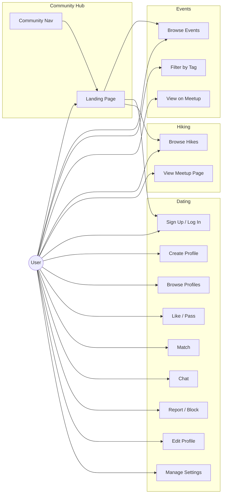
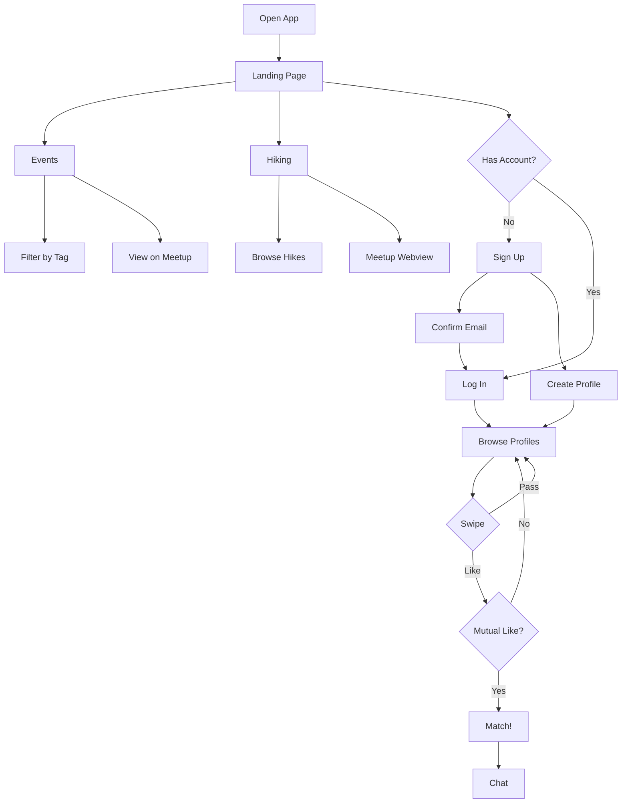

# BKB Community App - Use Cases

## Community Hub

The app serves as a hub for multiple community features. The landing page displays all sub-apps with a horizontal CommunityNav bar visible across all screens.

| Feature | Status | Route |
|---------|--------|-------|
| BKB Events | Active | `/events` |
| BKB Dating | Active | `/(auth)/login` → `/(tabs)/` |
| BKB Hiking | Active | `/hiking` |
| BKB Helpline | Coming Soon | — |
| BKB Women | Coming Soon | — |
| BKB Career | Coming Soon | — |
| BKB Stocks | Coming Soon | — |
| BKB Sports | Coming Soon | — |
| BKB Health | Coming Soon | — |
| BKB Divorce Support | Coming Soon | — |
| BKB Forums | Coming Soon | — |
| BKB Marketplace | Coming Soon | — |

---

## Use Case Diagram

---

## Use Case Details

### Community Hub

#### Landing Page
- View all community sub-apps as cards
- Tap active apps to navigate (Events, Dating, Hiking)
- Coming Soon badge on unreleased features

#### Community Navigation Bar
- Persistent horizontal nav at bottom of all screens
- Highlights the currently active sub-app
- Quick switch between Events, Dating, Hiking

### Events

#### Browse Events
- View 20+ BKB community events with title, date, time, location
- See attendee count, capacity, fee, and description
- Event types: Social, Family, Nightlife, Adventure, Cultural, Online, Hiking, Food

#### Filter Events by Tag
- Filter events by category tags
- "All" filter shows everything

#### View on Meetup
- Link to the BKB Meetup group page
- Group info: member count, rating, location (Fremont, CA)

### Hiking

#### Browse Hikes
- View upcoming and past hiking events
- See date, time, location, attendees, description
- Upcoming vs past hike distinction (past shown with reduced opacity)

#### View Meetup Page
- Embedded Meetup webview for the BKB hiking events page

### Dating

#### 1. Sign Up / Log In
- Register with email
- Log in with credentials
- Email confirmation flow

#### 2. Create Profile
- Add name, age, gender
- Write a short bio
- Select interests from a list

#### 3. Browse Profiles
- View one profile at a time (card stack)
- Profiles ranked by shared interests

#### 4. Like / Pass
- Tap heart to like
- Tap X to pass

#### 5. Match
- Both users like each other = match
- Both get a notification
- Chat is unlocked

#### 6. Chat
- Send text messages to matches
- Real-time message delivery via Supabase Realtime
- See online/last active status

#### 7. Report / Block
- Report inappropriate users
- Block a user to prevent contact
- Unmatch to remove a connection

#### 8. Edit Profile
- Update bio, interests
- Change preferences (age, distance, gender)

#### 9. Manage Settings
- Notification preferences
- Privacy settings (hide profile)
- Delete account

---

## User Flow

