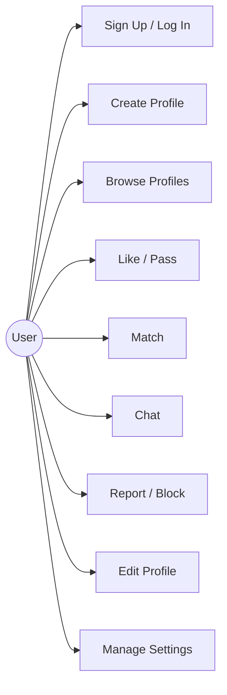
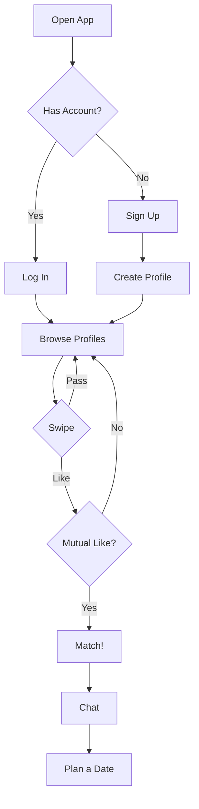

# Dating App - Use Cases

## Use Case Diagram

---

## Use Case Details

### 1. Sign Up / Log In
- Register with email or phone number
- Log in with credentials
- Reset password

### 2. Create Profile
- Add name, age, gender
- Write a short bio
- Upload up to 6 photos
- Select interests from a list

### 3. Browse Profiles
- View one profile at a time (card stack)
- Filter by age range, distance, gender

### 4. Like / Pass
- Swipe right to like
- Swipe left to pass

### 5. Match
- Both users like each other = match
- Both get a notification
- Chat is unlocked

### 6. Chat
- Send text messages to matches
- Send photos in chat
- See online/last active status

### 7. Report / Block
- Report inappropriate users
- Block a user to prevent contact
- Unmatch to remove a connection

### 8. Edit Profile
- Update photos, bio, interests
- Change preferences (age, distance, gender)

### 9. Manage Settings
- Notification preferences
- Privacy settings (hide profile)
- Delete account

---

## User Flow

